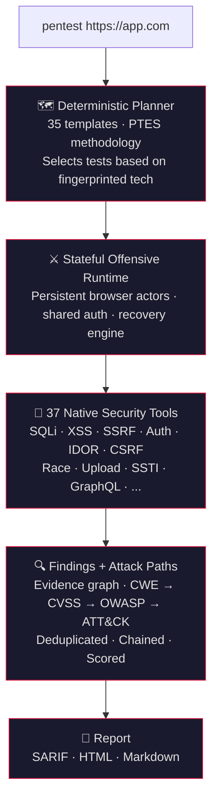

<h1 align="center">numasec</h1>
<h3 align="center">The AI agent for cyber security. Like Claude Code, but for cyber security.</h3>

<p align="center">
  
</p>

<p align="center">
  <a href="https://github.com/FrancescoStabile/numasec/stargazers"></a>
  <a href="#why-numasec"></a>
  <a href="LICENSE"></a>
  <a href="https://github.com/FrancescoStabile/numasec/actions/workflows/ci.yml"></a>
  <a href="https://github.com/FrancescoStabile/numasec/releases/latest"></a>
</p>

<p align="center">
  37 native security tools · 35 attack templates · 60+ LLM providers · open source
</p>

---

## Table of Contents

- [Quickstart](#quickstart)
- [Why numasec](#why-numasec)
- [Benchmarks](#benchmarks)
- [What it finds](#what-it-finds)
- [How it works](#how-it-works)
- [LLM Providers](#llm-providers)
- [Installation](#installation)
- [Usage](#usage)
- [Development](#development)
- [Contributing](#contributing)

---

## Quickstart

```bash
npm install -g numasec
numasec
```

Pick your provider, type `pentest https://yourapp.com`, and it starts.

**Recommended cheap model:** **Grok 4 Fast**

---

## Why numasec

Coding has Claude Code, Copilot, Cursor.
Cyber security has nothing.

Until now.

<p align="center">
  
</p>

- **Built for cyber security from the ground up.** Not a wrapper around ChatGPT. 37 native security tools, 35 attack templates, a deterministic planner, a stateful browser runtime, and an evidence-driven finding pipeline.
- **Recon. Exploit. Chain vulnerabilities. Generate reports.** Default credentials → admin access → user enumeration. SQLi → token issuance → account takeover. IDOR → data exposure → business impact.
- **Single binary, zero dependencies.** Pure TypeScript. No Python, no Docker, no runtime circus. `bun build` produces a single executable.
- **Attack paths, not isolated findings.** Findings get chained, scored, enriched, and exported in formats people actually use.
- **Works with any LLM.** xAI, Anthropic, OpenAI, Gemini, OpenRouter, Bedrock, GitHub Models, Ollama, and more. **Grok 4 Fast** is the recommended cheap default right now.

---

<p align="center">
  <a href="https://github.com/FrancescoStabile/numasec/stargazers">
    
  </a>
  <br/>
  <sub>If numasec is useful to you, a star helps more people find it.</sub>
</p>

---

## Benchmarks

| Benchmark | Result |
|---|---|
| **OWASP Juice Shop — standard 10 minute run** | **76 endpoints mapped** |
| **Auth exploitation** | **critical SQL injection in login -> admin JWT issuance** |
| **Data exposure** | **22 user records exposed through `/api/Users`** |
| **Broken access control** | **unauthorized basket-item deletion confirmed via IDOR** |
| **Evidence-driven Juice Shop run** | **3 high-severity findings confirmed · risk score 45/100** |
| **Runtime validation** | **45 / 45 runtime evaluation tests passing** |
| **Auth / recovery validation** | **15 / 15 focused auth / recovery / runtime tests passing** |

These are current benchmark snapshots from real run artifacts on this branch, not marketing numbers.

---

## What it finds

<table>
<tr>
<td width="33%">

**Injection**
- SQL injection (blind, time-based, union, error-based)
- NoSQL injection
- OS command injection
- Server-Side Template Injection
- XXE injection
- GraphQL introspection & injection
- CRLF injection

</td>
<td width="33%">

**Authentication & Access**
- JWT attacks (alg:none, weak HS256, kid traversal)
- OAuth misconfiguration
- Default credentials & password spray
- IDOR
- CSRF
- Privilege escalation

</td>
<td width="33%">

**Client & Server Side**
- XSS (reflected, stored, DOM)
- SSRF with cloud metadata detection
- CORS misconfiguration
- Path traversal / LFI
- Open redirect
- Race conditions
- File upload bypass
- Mass assignment

</td>
</tr>
</table>

Every finding includes **CWE ID**, **CVSS 3.1 score**, **OWASP Top 10 category**, **MITRE ATT&CK technique**, and **remediation steps**.

<p align="center">
  
</p>

---

## How it works



Reports include executive summary, risk score, OWASP coverage matrix, attack paths, and per-finding remediation. SARIF plugs into GitHub Code Scanning and GitLab SAST.

<p align="center">
  
</p>

---

## LLM Providers

All 37 tools execute inside numasec. You bring any LLM. Pick your provider from the TUI.

| Provider / model | Cost profile | Why |
|---|---|---|
| **xAI / Grok 4 Fast** | **Cheap** | Best value right now. Recommended budget default for numasec. |
| GPT-4.1 | Medium | Stable high-quality analysis |
| Claude Sonnet 4 | Premium | Best reasoning for deep chains and harder investigations |
| DeepSeek V3 | Cheap | Budget fallback |
| **Ollama (local)** | **$0** | Run locally. Full privacy |

> **DeepSeek is no longer the default recommendation.** Recent live runs favored **Grok 4 Fast** as the best cheap operator model for numasec.

<details>
<summary><b>All 60+ supported providers</b></summary>
<br>
Anthropic · OpenAI · Google Gemini · AWS Bedrock · Azure OpenAI · Mistral · DeepSeek · Ollama Cloud · OpenRouter · GitHub Copilot · GitHub Models · Google Vertex · Groq · Fireworks AI · Together AI · Cohere · Cerebras · Nvidia · Perplexity · xAI · Hugging Face · LM Studio · and 40+ more via OpenAI-compatible endpoints.
</details>

---

## Installation

### npm (recommended)

```bash
npm install -g numasec
numasec
```

### From source

```bash
git clone https://github.com/FrancescoStabile/numasec.git
cd numasec
bash install.sh
```

Or manually:

```bash
cd numasec/agent
bun install
cd packages/numasec
bun run build
# Binary at dist/numasec-<platform>-<arch>/bin/numasec
```

### Optional: external tools

numasec works standalone, but external tools extend its capabilities when available:

```bash
# Recommended
apt install nmap
bunx playwright install chromium

# Optional
apt install sqlmap
apt install ffuf
```

---

## Usage

```bash
numasec                  # Launch the TUI
```

### Agent modes

| Mode | What it does |
|---|---|
| 🔴 **pentest** | Full PTES methodology: recon → vuln testing → exploitation → report |
| 🔵 **recon** | Reconnaissance only, no exploitation |
| 🟠 **hunt** | Systematic OWASP-style vulnerability hunting |
| 🟡 **review** | Secure code review, no network scanning |
| 🟢 **report** | Findings, attack paths, and deliverables |

### Canonical workflow commands

| Command | Description |
|---|---|
| `/scope set <target>` | Set engagement scope and begin reconnaissance |
| `/scope show` | Show current scope and latest observed surface |
| `/hypothesis list` | List evidence-graph hypotheses |
| `/verify next` | Plan the next verification primitive |
| `/evidence list` | List findings with available evidence |
| `/evidence show <id-or-title>` | Show full evidence for one finding |
| `/chains list` | List derived attack paths |
| `/finding list` | List findings by severity |
| `/remediation plan` | Generate prioritized remediation actions |
| `/retest run [filter]` | Replay and retest saved findings |
| `/report generate [format] [--out <path>]` | Generate report (`markdown`, `html`, `sarif`) and optionally write to file |

Legacy aliases still supported in v1.x:

| Legacy command | Current replacement |
|---|---|
| `/target <url>` | `/scope set <url>` |
| `/findings` | `/finding list` |
| `/report <format>` | `/report generate <format>` |
| `/evidence` | `/evidence list` |
| `/evidence <id-or-title>` | `/evidence show <id-or-title>` |

---

## Development

```bash
cd agent
bun install

# Type check
bun typecheck

# Tests
cd packages/numasec && bun test --timeout 30000

# Runtime validation
cd packages/numasec && bun run test:runtime

# Build
cd packages/numasec && bun run build
```

---

## Contributing

Issues, PRs, and ideas are welcome.

- **Found a bug?** Open an issue with steps to reproduce.
- **Want to contribute code?** Fork, branch from `main`, open a PR.

---

<p align="center">
  Built by <a href="https://www.linkedin.com/in/francesco-stabile-dev">Francesco Stabile</a>.
</p>

<p align="center">
  <a href="https://www.linkedin.com/in/francesco-stabile-dev"></a>
  <a href="https://x.com/Francesco_Sta"></a>
</p>

<p align="center"><a href="LICENSE">MIT License</a></p>
