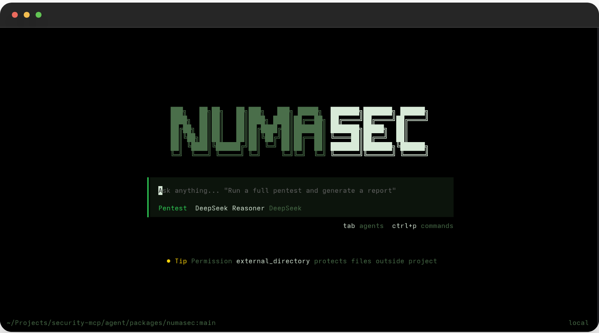

<h1 align="center">numasec</h1>
<h3 align="center">Your AI Cyber Security companion. Open source. Runs in the terminal.</h3>

<p align="center">
  
</p>

<p align="center">
  <a href="LICENSE"></a>
  <a href="https://www.python.org/"></a>
  <a href="https://github.com/FrancescoStabile/numasec/actions/workflows/ci.yml"></a>
  <a href="https://github.com/FrancescoStabile/numasec/releases/latest"></a>
</p>

---

```
curl -fsSL https://numasec.dev/install | bash
numasec
```

Type a URL, endpoint, everything. The AI scans it, finds vulnerabilities, and writes the report. You watch, approve, and steer — like pair-programming, but for security.

It follows real pentest methodology (PTES): reconnaissance, attack surface mapping, vulnerability testing, exploitation, reporting. Not a toy scanner that dumps a CSV. An actual AI agent that thinks, adapts, and chains attacks together.

Works with Claude, GPT-4, Gemini, DeepSeek, or any OpenAI-compatible model.

---

### What you see

A live terminal session. Findings pop up in a sidebar as they're discovered — color-coded by severity, grouped into attack chains, with OWASP Top 10 coverage tracking in the header. Everything is scoped: the agent won't touch anything outside your target.

Type `/target https://yourapp.com` to start. Type `/findings` to see what it found. Type `/report` to get the deliverable.

### What it finds

SQL injection (blind, time-based, union, error-based), XSS (reflected, stored, DOM), SSRF with cloud metadata detection, authentication flaws (JWT attacks, OAuth misconfig, credential spraying, default passwords), IDOR, CSRF, CORS misconfig, path traversal, LFI, command injection, SSTI, XXE, GraphQL introspection — and it chains them. A leaked API key in JS → SSRF → cloud metadata → account takeover.

### What it produces

- **SARIF** — drop it into GitHub Code Scanning
- **HTML** — share with the team
- **Markdown / JSON** — integrate anywhere

Every finding comes with CWE ID, CVSS 3.1 score, OWASP category, MITRE ATT&CK technique, and remediation guidance. Not just "you have a vuln" — actionable output.

---

### How it works

The terminal is a TypeScript TUI (forked from [OpenCode](https://github.com/opencode-ai/opencode), MIT) driving 21 Python security scanners through a JSON-RPC bridge. A knowledge base of 34 templates covers detection patterns, exploitation techniques per DBMS/engine/OS, post-exploitation, payloads, and remediation — so the AI doesn't hallucinate attack methodology, it looks it up.

96% recall on OWASP Juice Shop v17 — 25 of 26 ground-truth vulnerabilities found across all 10 OWASP categories.

---

### Development

```bash
pip install -e ".[all]"
pytest tests/ -v
ruff check numasec/
```

924 tests. Benchmarks against Juice Shop, DVWA, and WebGoat in `tests/benchmarks/`.

---

**Built by [Francesco Stabile](https://www.linkedin.com/in/francesco-stabile-dev)**.

[](https://www.linkedin.com/in/francesco-stabile-dev)
[](https://x.com/Francesco_Sta)

[MIT License](LICENSE)
