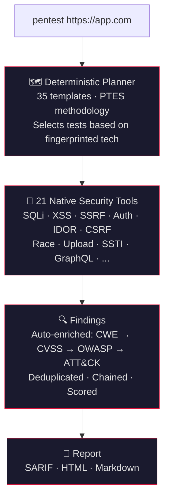

<h1 align="center">numasec</h1>
<h3 align="center">The AI agent for security. Like Claude Code, but for pentesting.</h3>

<p align="center">
  
</p>

<p align="center">
  <a href="https://github.com/FrancescoStabile/numasec/stargazers"></a>
  <a href="#why-numasec"></a>
  <a href="LICENSE"></a>
  <a href="https://github.com/FrancescoStabile/numasec/actions/workflows/ci.yml"></a>
  <a href="https://github.com/FrancescoStabile/numasec/releases/latest"></a>
</p>

<p align="center">
  21 native security tools · 35 attack templates · 60+ LLM providers · open source
</p>

---

## Table of Contents

- [Quickstart](#quickstart)
- [Why numasec](#why-numasec)
- [What it finds](#what-it-finds)
- [How it works](#how-it-works)
- [LLM Providers](#llm-providers)
- [Installation](#installation)
- [Usage](#usage)
- [Development](#development)
- [Contributing](#contributing)

---

## Quickstart

```bash
npm install -g numasec
numasec
```

Pick your LLM provider, type `pentest https://yourapp.com`, and it starts.

---

## Why numasec

Coding has Claude Code, Copilot, Cursor. Security has nothing.

Every other domain got its AI agent. Security didn't. So I built one.

<p align="center">
  
</p>

- **Built for security from the ground up.** Not a wrapper around ChatGPT. 21 native security tools, 35 attack templates, a deterministic planner based on the [CHECKMATE](https://arxiv.org/abs/2512.11143) paper. The AI coordinates and analyzes. It doesn't hallucinate the methodology.
- **Single binary, zero dependencies.** Pure TypeScript. No Python, no Docker, no runtime to install. `bun build` produces a single executable.
- **Attack chains, not isolated findings.** Leaked API key in JS → SSRF → cloud metadata → account takeover. Documented with full evidence.
- **Works with any LLM.** 60+ providers: Anthropic, OpenAI, Gemini, DeepSeek, Ollama, AWS Bedrock, and more.

---

<p align="center">
  <a href="https://github.com/FrancescoStabile/numasec/stargazers">
    
  </a>
  <br/>
  <sub>If numasec is useful to you, a star helps more people find it.</sub>
</p>

---

## What it finds

<table>
<tr>
<td width="33%">

**Injection**
- SQL injection (blind, time-based, union, error-based)
- NoSQL injection
- OS command injection
- Server-Side Template Injection
- XXE injection
- GraphQL introspection & injection
- CRLF injection

</td>
<td width="33%">

**Authentication & Access**
- JWT attacks (alg:none, weak HS256, kid traversal)
- OAuth misconfiguration
- Default credentials & password spray
- IDOR
- CSRF
- Privilege escalation

</td>
<td width="33%">

**Client & Server Side**
- XSS (reflected, stored, DOM)
- SSRF with cloud metadata detection
- CORS misconfiguration
- Path traversal / LFI
- Open redirect
- Race conditions
- File upload bypass
- Mass assignment

</td>
</tr>
</table>

Every finding includes **CWE ID**, **CVSS 3.1 score**, **OWASP Top 10 category**, **MITRE ATT&CK technique**, and **remediation steps**. Auto-generated, validated by the analyst agent before entering the report.

<p align="center">
  
</p>

---

## How it works



Reports include executive summary, risk score (0-100), OWASP coverage matrix, attack chain documentation, and per-finding remediation. SARIF plugs into GitHub Code Scanning and GitLab SAST.

<p align="center">
  
</p>

---

## LLM Providers

All 21 tools run locally. You bring any LLM. Pick your provider from the TUI.

| Provider | Cost per pentest | Why |
|---|---|---|
| **DeepSeek** | **~$0.07** | Best value. [Free tier available](https://platform.deepseek.com/) |
| GPT-4.1 | ~$1 | Higher quality analysis |
| Claude Sonnet 4 | ~$1.50 | Best reasoning for complex chains |
| **Ollama (local)** | **$0** | Run locally. Full privacy |
| AWS Bedrock / Azure | Varies | Enterprise compliance |

<details>
<summary><b>All 60+ supported providers</b></summary>
<br>
Anthropic · OpenAI · Google Gemini · AWS Bedrock · Azure OpenAI · Mistral · DeepSeek · Ollama Cloud · OpenRouter · GitHub Copilot · GitHub Models · Google Vertex · Groq · Fireworks AI · Together AI · Cohere · Cerebras · Nvidia · Perplexity · xAI · Hugging Face · LM Studio · and 40+ more via OpenAI-compatible endpoints.
</details>

---

## Installation

### npm (recommended)

```bash
npm install -g numasec
numasec
```

### From source

```bash
git clone https://github.com/FrancescoStabile/numasec.git
cd numasec
bash install.sh
```

Or manually:

```bash
cd numasec/agent
bun install
bun run build
# Binary at agent/packages/numasec/dist/numasec-<platform>-<arch>/bin/numasec
```

### Optional: external tools

numasec works standalone, but external tools extend its capabilities when available:

```bash
# Recommended
apt install nmap           # port scanning
npm install -g playwright  # browser automation for DOM XSS

# Optional
apt install sqlmap         # advanced SQL injection
apt install ffuf           # fast directory fuzzing
```

---

## Usage

```bash
numasec                  # Launch the TUI
```

### Slash commands

| Command | Description |
|---|---|
| `/target <url>` | Set target and start scanning |
| `/findings` | List discovered vulnerabilities |
| `/report <format>` | Generate report (markdown, html, sarif) |
| `/coverage` | OWASP Top 10 coverage matrix |
| `/creds` | Discovered credentials |
| `/evidence <id>` | Evidence for a specific finding |
| `/review` | Security review of code changes |
| `/init` | Analyze app and create security profile |

### Agent modes

| Mode | What it does |
|---|---|
| 🔴 **pentest** | Full PTES methodology: recon → vuln testing → exploitation → report (default) |
| 🔵 **recon** | Reconnaissance only, no exploitation |
| 🟠 **hunt** | Systematic OWASP Top 10 sweep |
| 🟡 **review** | Secure code review, no network scanning |
| 🟢 **report** | Finding management and deliverables |

### Security tools

| Tool | Description |
|---|---|
| `recon` | Port scan + service probe + tech fingerprint |
| `crawl` | Spider + OpenAPI + sitemap discovery |
| `dir_fuzz` | Directory brute-force |
| `js_analyze` | JS endpoint/secret extraction |
| `injection_test` | SQL/NoSQL/SSTI/CmdI/CRLF/LFI/XXE |
| `xss_test` | Reflected XSS |
| `auth_test` | JWT analysis + credential testing |
| `access_control_test` | IDOR/CSRF/CORS/mass assignment |
| `ssrf_test` | SSRF with cloud metadata |
| `upload_test` | File upload bypass |
| `race_test` | Race condition detection |
| `graphql_test` | Introspection, batching, depth attacks |
| `kb_search` | Security knowledge base search (BM25) |
| `pentest_plan` | PTES methodology planner |
| `save_finding` | Persist finding with auto-enrichment |
| `get_findings` | Retrieve findings |
| `build_chains` | Group findings into attack chains |
| `generate_report` | SARIF/HTML/Markdown report |
| `http_request` | Raw HTTP with full control |
| `security_shell` | Shell execution (nmap, sqlmap, etc.) |
| `browser` | Playwright automation |

---

## Development

```bash
cd agent
bun install

# Type check
bun typecheck

# Tests
cd packages/numasec && bun test

# Build
bun run build
```

---

## Contributing

Issues, PRs, and ideas are welcome.

- **Found a bug?** Open an issue with steps to reproduce.
- **Want to contribute code?** Fork, branch from `main`, open a PR.

---

<p align="center">
  Built by <a href="https://www.linkedin.com/in/francesco-stabile-dev">Francesco Stabile</a>.
</p>

<p align="center">
  <a href="https://www.linkedin.com/in/francesco-stabile-dev"></a>
  <a href="https://x.com/Francesco_Sta"></a>
</p>

<p align="center"><a href="LICENSE">MIT License</a></p>

